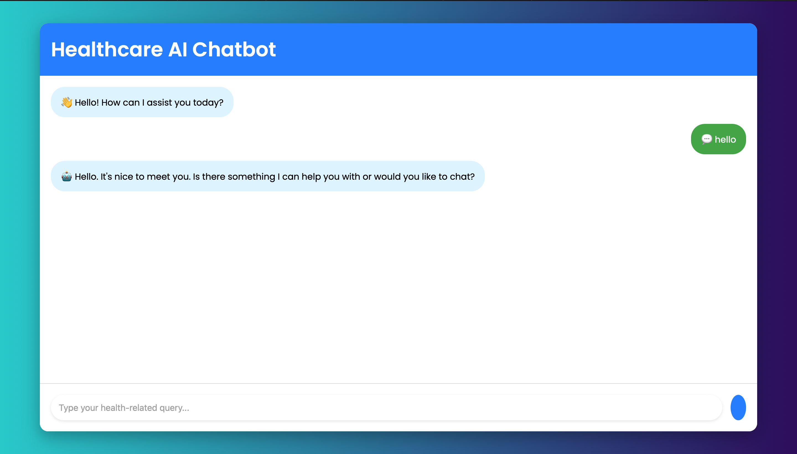
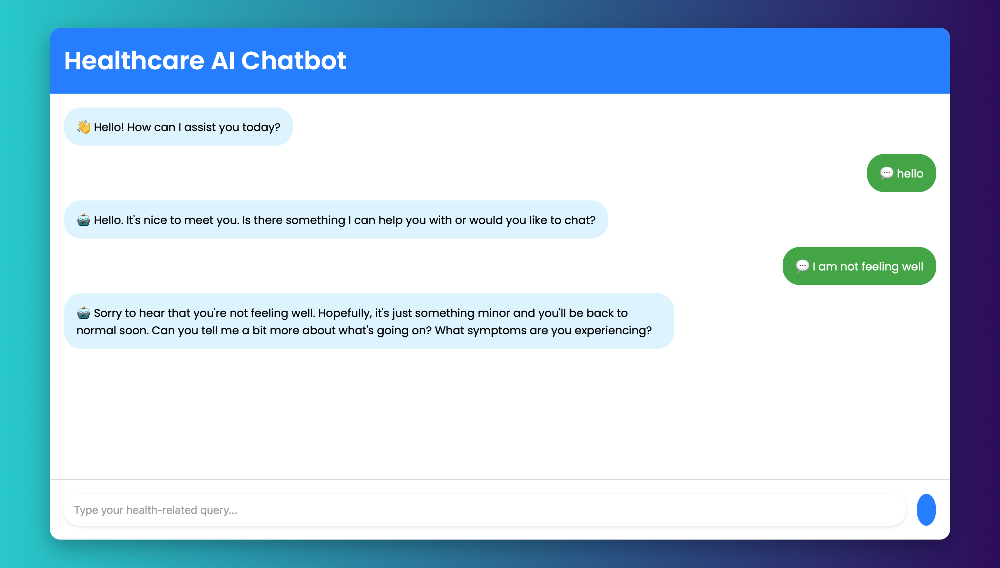
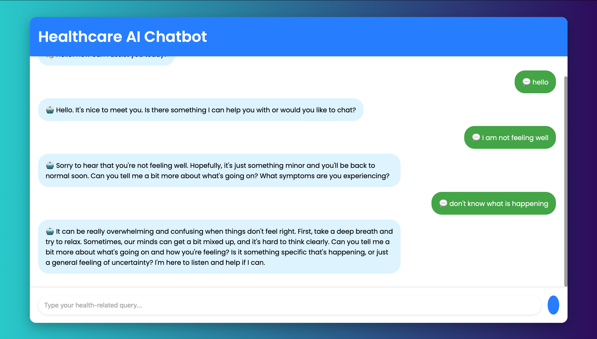
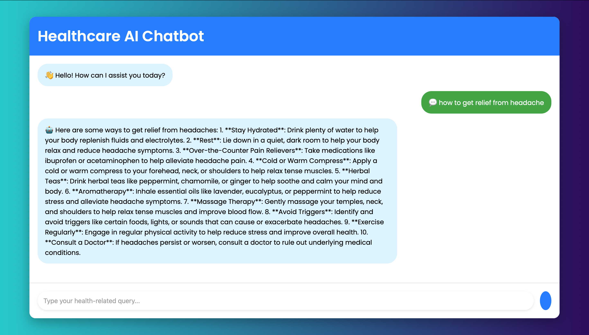

# Healthcare AI Chatbot 🚀🤖

A modern, responsive chatbot built with **FastAPI** and **Groq LLM**, designed to assist with healthcare-related queries. 🏥💡  
Featuring a sleek UI, full-screen experience, real-time interaction, and smooth animations for an intuitive user experience. 🌟  
Integrates seamlessly with backend APIs for accurate and insightful responses. 💪

## Features ✨
- Full-Screen, sleek, and modern UI
- Real-time chatbot interaction
- Built with **FastAPI** for the backend and **Groq LLM** for AI processing
- Smooth animations for a delightful user experience
- Responsive, works on mobile and desktop

## Technologies Used 💻
- **Backend**: FastAPI, Groq LLM
- **Frontend**: HTML, CSS, JavaScript
- **Deployment**: Localhost or any cloud hosting platform


## 📸 Screenshots


### 🔹 **Frontend Interface **




  

## Setup Instructions ⚙️

### 1. Clone the Repository
```bash
git clone https://github.com/yourusername/healthcare-chatbot.git
cd healthcare-chatbot
```

### 2. Install Dependencies for FastAPI Backend
```bash
pip install -r requirements.txt
```

### 3. Run the Backend Server
```bash
uvicorn main:app --reload
```
This will start the FastAPI server on `http://127.0.0.1:8000`.  

### 4. Run the Frontend
Simply open `index.html` in your browser to start the chatbot interface.

### 5. Test the Chatbot
- Open `index.html` and start chatting with the AI.
- The chatbot uses a real-time query system to process healthcare-related questions.

## API Endpoints 📡

### `/chat/` [POST]
- **Request Body**:
```json
{
    "message": "Your healthcare-related question here"
}
```
- **Response**:
```json
{
    "status": "success",
    "response": "AI's response to your query"
}
```

## Contributions 👥
Feel free to fork the repository and submit pull requests. Suggestions, issues, and improvements are always welcome! 🌱

## License 📜
This project is open-source and available under the MIT License.

---

🚀 Let's make healthcare more accessible with AI! 🩺💬
